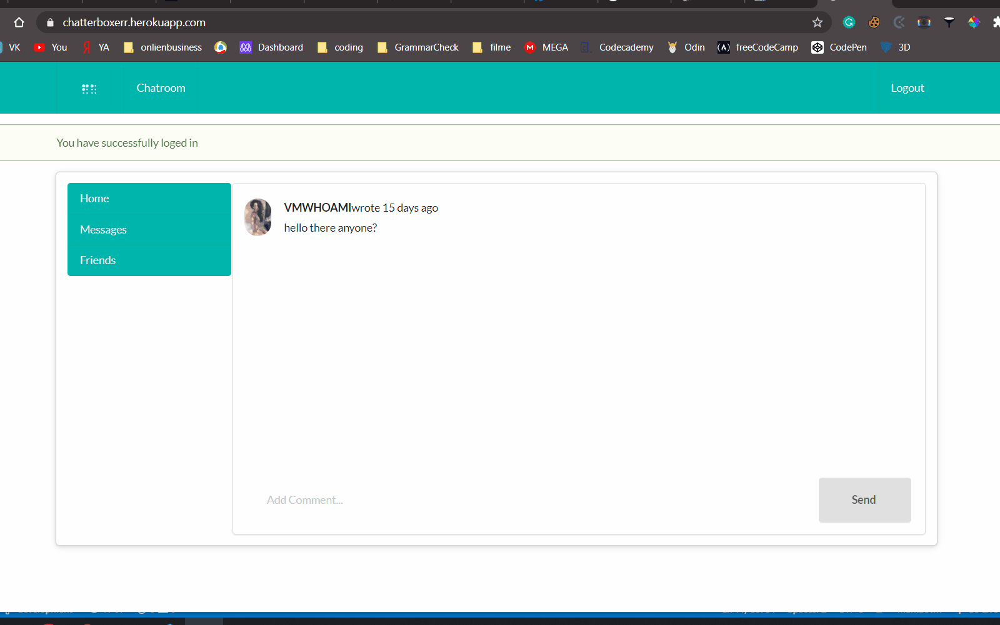

# Chat app with Ruby on Rails

> In this project I developed a chat app using Ruby on Rails websocket with Semantic Ui for the front-end.

Some of the advanced concepts explored in this project includes.

- Rails websocket
- Semantic Ui
-



## Built With

- Ruby v2.7.0
- Ruby on Rails v5.2.4

## Live Demo

[Live Demo](https://chatterboxerr.herokuapp.com/)

## Getting Started

To get a local copy up and running follow these simple example steps.

### Prerequisites

Ruby: 2.6.3
Rails: 6.0.3
Postgres: >=9.5

### Setup

```bash

$ git clone https://github.com/vmwhoami/chat-app
$ cd ror-social-scaffold
```

Install gems with:

```
bundle install
```

Setup database with:

> make sure you have postgress sql installed and running on your system

```
   rails db:create
   rails db:migrate
```

### Usage

Start server with:

```
    rails server
```

Open `http://localhost:3000/` in your browser.

# Author

👤 **Vitalie Melnic**

- Github: [@vmwhoami](https://github.com/vmwhoami/)
- Twitter: [@vmwhoami](https://twitter.com/acushlakoncept)
- Linkedin: [vitalie-melnic](https://www.linkedin.com/in/vitalie-melnic/)

## 🤝 Contributing

Contributions, issues and feature requests are welcome!

Feel free to check the [issues page](issues/).

## Show your support

Give a ⭐️ if you like this project!

## Acknowledgments

- Microverse TSE members who reviewed and gave us positive feedbacks and guidance.
- Microverse
